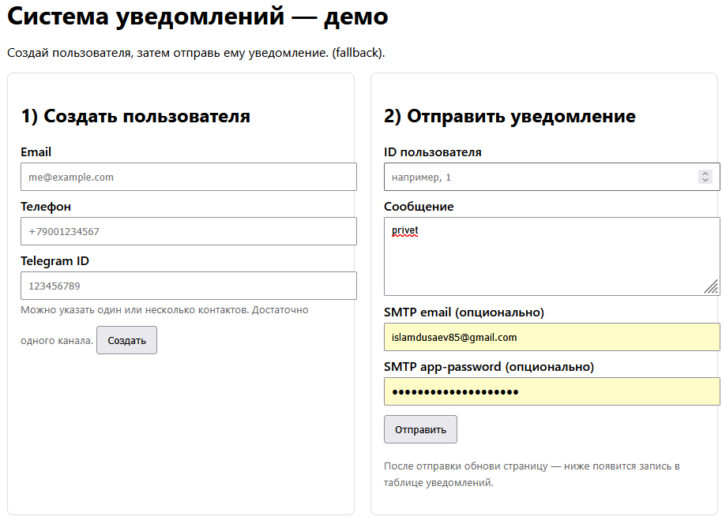
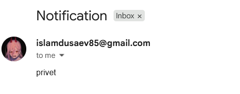
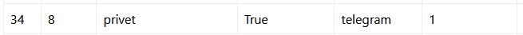
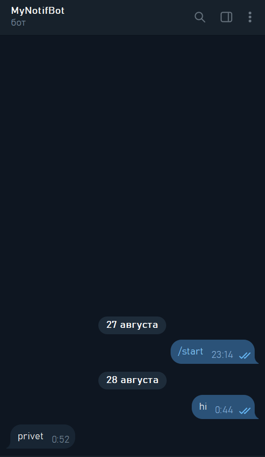

# Система уведомлений (Email → SMS → Telegram с fallback)

Мини-сервис на Django + DRF + Celery + Redis. Отправляет уведомления пользователям по цепочке: сначала Email, затем SMS, затем Telegram. Если канал недоступен, пробует следующий. Есть простая HTML-страница для ручной проверки, REST API и скрипты запуска для Windows.

## Стек
- Python 3.10+
- Django 3.2 (LTS), DRF
- Celery 5, Redis (как брокер и backend результатов)
- PostgreSQL (опционально; по умолчанию SQLite)
- cacheops (точечное кеширование)
- (опционально) drf-spectacular для Swagger UI
## Возможности

- Асинхронная отправка через Celery/Redis.
    
- Надёжная доставка с fallback: email → sms → telegram.
    
- Простая демо-страница `/` для кликового теста.
    
- REST API: создание пользователя и постановка уведомления в очередь.
    
- Конфигурация через `.env`. Быстрый dev-режим без Redis (eager).
## Отправка через Email (SMTP)
Реализована отправка писем через `smtplib`. Нужны:
1. **Почтовый ящик** (поддерживаемый SMTP).  
2. **App Password** (пароль приложения).  

### Настройка через `.env`
```env
SMTP_HOST=smtp.gmail.com
SMTP_PORT=587
SMTP_USE_TLS=1
SMTP_DEFAULT_USER=your_account@gmail.com
SMTP_DEFAULT_PASSWORD=your_app_password
DEFAULT_FROM_EMAIL=your_account@gmail.com
```
### Разово через HTML-страницу
На форме отправки уведомления есть поля `smtp_user` и `smtp_password`.  
Если их заполнить, они будут использованы только для этой отправки.
Пример (демо-страница):


Пример (API):
```
# создать пользователя
curl -X POST http://127.0.0.1:8000/api/users/ \
  -H "Content-Type: application/json" \
  -d '{"email":"user@example.com"}'

# поставить уведомление в очередь
curl -X POST http://127.0.0.1:8000/api/notifications/ \
  -H "Content-Type: application/json" \
  -d '{"user_id": 1, "message": "Hello via SMTP!"}'
```
### Отправка через Telegram-бота
Реализована отправка сообщений через Telegram Bot API.
Пользователь обязан сначала активировать чат с ботом (нажать **Start** или написать сообщение), иначе доставка невозможна.
Настройка через `.env`
```env
TELEGRAM_BOT_TOKEN=1234567890:AA...your-bot-token...
TELEGRAM_PARSE_MODE=HTML
TELEGRAM_DISABLE_WPP=1
TELEGRAM_TIMEOUT=10
```
Пример (демо-страница):

